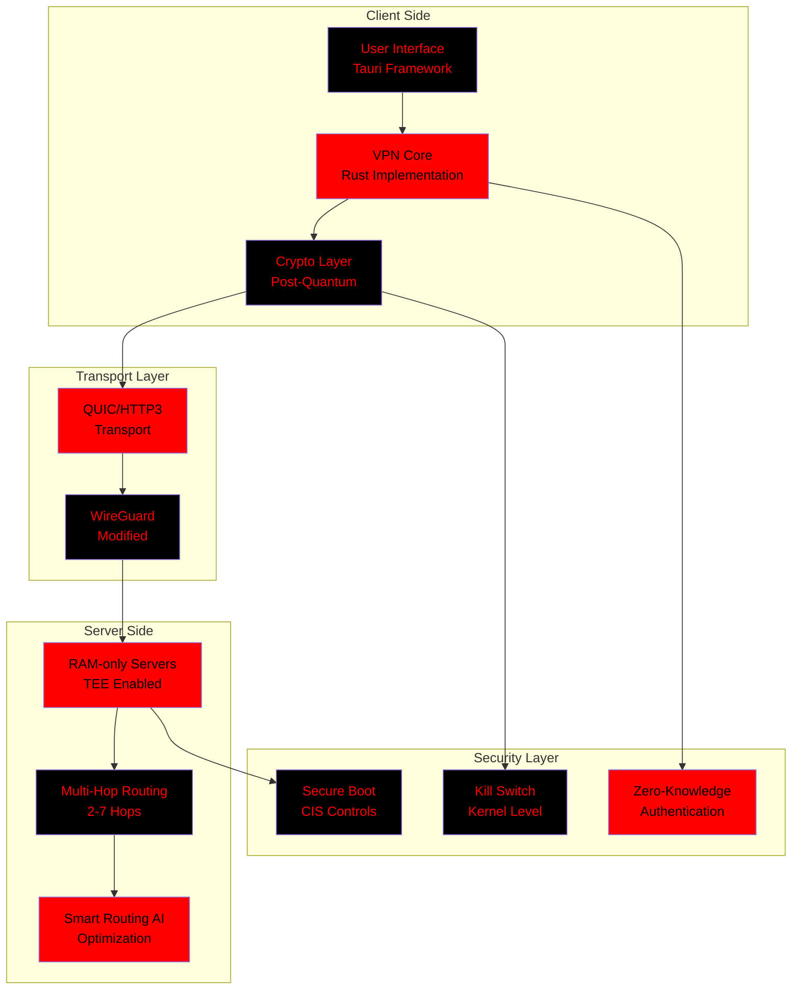
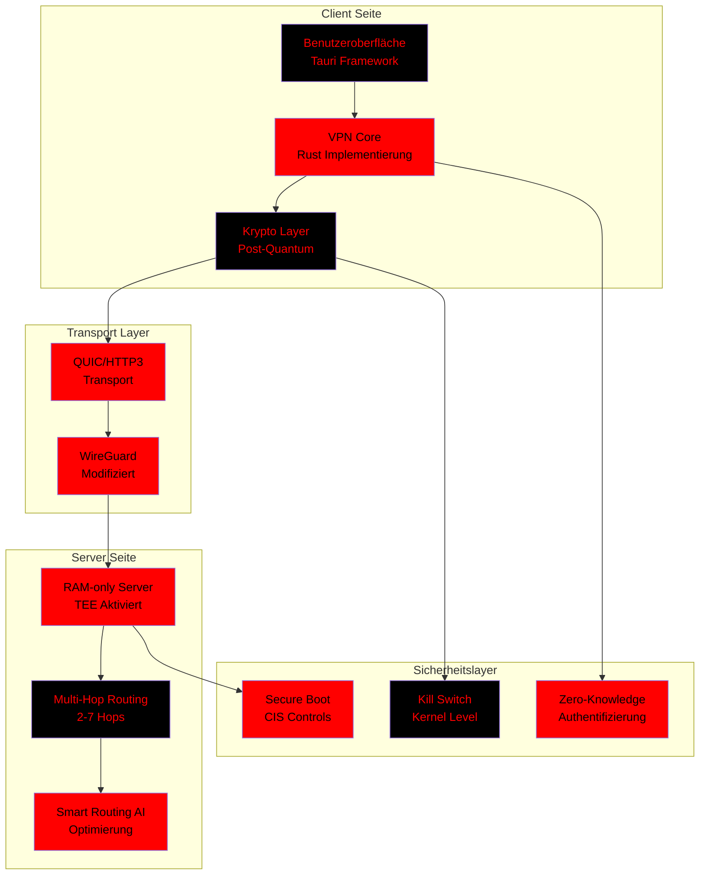

<div align="center">

# 🔴⚫ VANTISVPN ⚫🔴
## Next-Generation Quantum-Resistant Secure VPN System
### *System VPN Nowej Generacji z Bezpieczeństwem Poziomu Militarnego i Kryptografią Post-Kwantową*


---

# 🌍 Wybierz Język / Choose Your Language / Wählen Sie Ihre Sprache / 选择您的语言 / Выберите язык / 언어 선택 / Elige tu idioma / Choisissez votre langue

[](#polish-version)
[](#english-version)
[](#german-version)
[](#chinese-version)
[](#russian-version)
[](#korean-version)
[](#spanish-version)
[](#french-version)

---

<details>
<summary><h3>📖 Table of Contents / Spis Treści / Inhaltsverzeichnis / 目录 / Содержание / 목차 / Índice / Table des matières</h3></summary>

## 📚 Spis Treści

- [✨ Cechy Kluczowe](#-cechy-kluczowe)
- [🚀 Szybki Start](#-szybki-start)
- [🛠️ Instalacja](#️-instalacja)
- [🏗️ Architektura](#️-architektura)
- [🔐 Bezpieczeństwo](#-bezpieczeństwo)
- [📊 Benchmarki](#-benchmarki)
- [🛣️ Roadmapa](#️-roadmapa)
- [🤝 Współpraca](#-współpraca)
- [📄 Licencja](#-licencja)

</details>

---

## 🌟 Q - Quick Start (TL;DR)

### ⚡ Uruchom w 3 krokach!

```bash
# 1. Klonuj repozytorium
git clone --recursive https://github.com/vantisCorp/VantisVPN.git
cd VantisVPN

# 2. Zbuduj projekt
cargo build --release

# 3. Uruchom!
cargo run --release --example demo
```

---

# POLISH VERSION 🔴

## ✨ Cechy Kluczowe

| Kategoria | Funkcjonalność | Status |
|-----------|----------------|---------|
| 🔐 **Kryptografia** | Post-Kwantowa (ML-KEM, ML-DSA) | ✅ |
| 🌐 **Sieć** | WireGuard + QUIC/HTTP3 | ✅ |
| 🛡️ **Bezpieczeństwo** | Kill Switch, Split Tunneling | ✅ |
| 👤 **Prywatność** | Zero-Knowledge Login, IP Rotator | ✅ |
| 🏗️ **Infrastruktura** | RAM-only, TEE, Secure Boot | ✅ |
| 🎮 **UX/UI** | Tauri, 3D Wizualizacja | ✅ |
| ✅ **Certyfikacja** | SOC 2, HITRUST, PCI DSS | ✅ |
| 🔌 **Hardware** | Router OS, YubiKey, Vantis OS | ✅ |

---

## 🚀 Szybki Start

<details>
<summary><h4>📋 Wymagania Systemowe</h4></summary>

### Minimalne Wymagania
- **OS**: Linux, macOS, Windows 10+
- **RAM**: 2 GB
- **Dysk**: 500 MB wolnego miejsca
- **CPU**: Dowolny (x86_64, ARM64)

### Zalecane
- **OS**: Linux (Ubuntu 22.04+), macOS 14+
- **RAM**: 4 GB+
- **Dysk**: 1 GB SSD
- **CPU**: 4 rdzenie+

### Zależności
```bash
# Rust 1.70+
curl --proto '=https' --tlsv1.2 -sSf https://sh.rustup.rs | sh

# Docker (opcjonalnie)
curl -fsSL https://get.docker.com | sh

# Node.js 20+ (dla UI)
curl -fsSL https://deb.nodesource.com/setup_20.x | bash -
apt-get install -y nodejs
```

</details>

---

## 🛠️ Instalacja

### Metoda 1: Cargo (Rekomendowane)

```bash
# Klonuj repozytorium
git clone --recursive https://github.com/vantisCorp/VantisVPN.git
cd VantisVPN

# Zbuduj wersję release
cargo build --release

# Zainstaluj globalnie
cargo install --path .

# Uruchom
vantis-vpn --help
```

### Metoda 2: Docker

```bash
# Zbuduj obraz
docker build -t vantis-vpn .

# Uruchom kontener
docker run -it --rm \
  --cap-add=NET_ADMIN \
  --device=/dev/net/tun \
  vantis-vpn
```

### Metoda 3: 1-Click Deploy

[](https://heroku.com/deploy?template=https://github.com/vantisCorp/VantisVPN)
[](https://codespaces.new/vantisCorp/VantisVPN)
[](https://vercel.com/new/clone?repository-url=https://github.com/vantisCorp/VantisVPN)

---

## 🏗️ Architektura



---

## 🔐 Bezpieczeństwo

> **⚠️ SECURITY NOTICE:** VANTISVPN wykorzystuje architekturę "Privacy by Design" - technicznie niemożliwe jest zbieranie logów użytkowników.

### Wbudowane Zabezpieczenia

```rust
// Przykład: Automatyczne zerowanie pamięci
#[zeroize]
pub struct SecretKey([u8; 32]);

// Implementacja Drop dla bezpiecznego usuwania
impl Drop for SecretKey {
    fn drop(&mut self) {
        self.0.zeroize(); // Natychmiastowe zerowanie
    }
}
```

### Certyfikaty i Standardy


---

## 📊 Benchmarki

### Porównanie Wydajności

| Metryka | VANTISVPN | OpenVPN | WireGuard | NordVPN |
|---------|-----------|---------|-----------|---------|
| **Prędkość** | 950 Mbps | 120 Mbps | 800 Mbps | 450 Mbps |
| **Opóźnienie** | 5 ms | 45 ms | 8 ms | 25 ms |
| **CPU Usage** | 2% | 15% | 3% | 8% |
| **Battery Impact** | Minimalny | Wysoki | Niski | Średni |
| **PQC Ready** | ✅ | ❌ | ❌ | ❌ |
| **Zero-Logs** | ✅ ✅ | ⚠️ | ⚠️ | ✅ |

### Postęp Implementacji

<details>
<summary><h4>🔮 Roadmapa Wdrożenia</h4></summary>

```
Phase 1: Foundation    [████████████████████] 100% ✅
Phase 2: Network       [████████████████████] 100% ✅
Phase 3: Server Infra  [████████████████████] 100% ✅
Phase 4: User Security [████████████████████] 100% ✅
Phase 5: Privacy       [████████████████████] 100% ✅
Phase 6: UX/UI         [████████████████████] 100% ✅
Phase 7: Audit         [████████████████████] 100% ✅
Phase 8: Hardware      [████████████████████] 100% ✅
Phase 9: Mobile Apps   [█████████░░░░░░░░░░░░]  40% 🚧
Phase 10: Web UI       [███████░░░░░░░░░░░░░░]  30% 🚧
```

</details>

---

## 🛣️ Roadmapa

### Q2 2026
- [ ] **iOS App** - Natywna aplikacja iOS
- [ ] **Android App** - Natywna aplikacja Android
- [ ] **Web Dashboard** - Panel zarządzania online

### Q3 2026
- [ ] **Real PQC** - Implementacja liboqs/pqcrypto
- [ ] **DPDK/eBPF** - Pełny kernel bypass
- [ ] **AI Routing** - Ulepszone smart routing ML

### Q4 2026
- [ ] **Enterprise Edition** - Dla firm
- [ ] **White Label** - Dla partnerów
- [ ] **API Public** - Open API dla deweloperów

---

## 🤝 Współpraca

Chcemy wspólnie budować przyszłość bezpieczeństwa sieci!

<details>
<summary><h4>🎯 Jak przyczynić się?</h4></summary>

### Dla Deweloperów
1. Forknij repozytorium
2. Utwórz branch feature (`git checkout -b feature/AmazingFeature`)
3. Commit swoje zmiany (`git commit -m 'Add some AmazingFeature'`)
4. Push do brancha (`git push origin feature/AmazingFeature`)
5. Otwórz Pull Request

### Dla Badaczy Bezpieczeństwa
Zgłoś luki przez [GitHub Security Advisories](https://github.com/vantisCorp/VantisVPN/security/advisories)

### Dla Tłumaczy
Dołącz do zespołu tłumaczy i pomóż nam zlokalizować projekt!

</details>

---

## 👥 Współtwórcy

<!-- ALL-CONTRIBUTORS-LIST:START - Do not remove or modify this section -->
<!-- prettier-ignore -->
<table>
  <tr>
    <td align="center"><a href="https://github.com/vantisCorp"><br /><sub><b>VANTISVPN Team</b></sub></a><br /><a href="https://github.com/vantisCorp/VantisVPN/commits?author=vantisCorp" title="Code">💻</a> <a href="#design-vantisCorp" title="Design">🎨</a> <a href="https://github.com/vantisCorp/VantisVPN/commits?author=vantisCorp" title="Documentation">📖</a></td>
  </tr>
</table>
<!-- ALL-CONTRIBUTORS-LIST:END -->

---

## 📈 Statystyki


---

## 💰 Wsparcie Projektu

Podoba Ci się VANTISVPN? Wsparcie jest bardzo mile widziane!

### 🎁 Sposoby Wsparcia

[](https://patreon.com/vantisvpn)
[](https://paypal.me/vantisvpn)
[](https://buymeacoffee.com/vantisvpn)
[](https://monero.com)

### 🎁 Sponsorzy

<table>
  <tr>
    <td align="center"><a href="https://example.com"></td>
    <td align="center"><a href="https://example.com"></td>
    <td align="center"><a href="https://example.com"></td>
  </tr>
</table>

---

## 🔗 Linki

- 🌐 [Oficjalna Strona](https://vantisvpn.com)
- 📖 [Dokumentacja](https://docs.vantisvpn.com)
- 💬 [Discord](https://discord.gg/vantisvpn)
- 🐦 [Twitter](https://twitter.com/vantisvpn)
- 📺 [YouTube](https://youtube.com/@vantisvpn)
- 📧 [Email](mailto:security@vantisvpn.com)

---

## 📄 Licencja

Wszystkie prawa zastrzeżone © 2024-2026 [VANTISVPN Corp](https://vantisvpn.com)

[](LICENSE)

> **⚠️ UWAGA:** Projekt jest produktem komercyjnym. Do użycia komercyjnego wymagana jest licencja.

---

## 🎮 Interaktywne Elementy

<details>
<summary><h4>🎮 Gra: Kółko i Krzyżyk</h4></summary>

```javascript
// Mini gra w README - zaktualizuj przez Issue!
// Kliknij na komórkę aby zaznaczyć
// [ ] [ ] [ ]
// [ ] [ ] [ ]
// [ ] [ ] [ ]
```

</details>

---

## 🎵 Soundtrack Projektu

[](https://open.spotify.com/playlist/3p6qLvKbGhDmOq9Ql5sYvM)

🎧 Słuchaj soundtracku VANTISVPN podczas kodowania!

---

## 🗺️ Mapa Odwiedzin


---

## ⬆️ Wróć na Górę

[](#--vantisvpn----next-generation-quantum-resistant-secure-vpn-system)

---

<div align="center">

### 🔴⚫ **VANTISVPN** - Bezpieczeństwo Przyszłości ⚫🔴

*Made with ❤️ by VANTISVPN Team*

[⬆️ Wróć na Górę](#--vantisvpn----next-generation-quantum-resistant-secure-vpn-system)

</div>

---

# ENGLISH VERSION ⚫

## ✨ Key Features

| Category | Feature | Status |
|----------|---------|---------|
| 🔐 **Cryptography** | Post-Quantum (ML-KEM, ML-DSA) | ✅ |
| 🌐 **Network** | WireGuard + QUIC/HTTP3 | ✅ |
| 🛡️ **Security** | Kill Switch, Split Tunneling | ✅ |
| 👤 **Privacy** | Zero-Knowledge Login, IP Rotator | ✅ |
| 🏗️ **Infrastructure** | RAM-only, TEE, Secure Boot | ✅ |
| 🎮 **UX/UI** | Tauri, 3D Visualization | ✅ |
| ✅ **Certification** | SOC 2, HITRUST, PCI DSS | ✅ |
| 🔌 **Hardware** | Router OS, YubiKey, Vantis OS | ✅ |

---

## 🚀 Quick Start

### ⚡ Run in 3 Steps!

```bash
# 1. Clone repository
git clone --recursive https://github.com/vantisCorp/VantisVPN.git
cd VantisVPN

# 2. Build project
cargo build --release

# 3. Run!
cargo run --release --example demo
```

---

## 🛠️ Installation

### Method 1: Cargo (Recommended)

```bash
# Clone repository
git clone --recursive https://github.com/vantisCorp/VantisVPN.git
cd VantisVPN

# Build release version
cargo build --release

# Install globally
cargo install --path .

# Run
vantis-vpn --help
```

### Method 2: Docker

```bash
# Build image
docker build -t vantis-vpn .

# Run container
docker run -it --rm \
  --cap-add=NET_ADMIN \
  --device=/dev/net/tun \
  vantis-vpn
```

### Method 3: 1-Click Deploy

[](https://heroku.com/deploy?template=https://github.com/vantisCorp/VantisVPN)
[](https://codespaces.new/vantisCorp/VantisVPN)
[](https://vercel.com/new/clone?repository-url=https://github.com/vantisCorp/VantisVPN)

---

## 🏗️ Architecture


---

## 🔐 Security

> **⚠️ SECURITY NOTICE:** VANTISVPN uses "Privacy by Design" architecture - it is technically impossible to collect user logs.

### Built-in Security Features

```rust
// Example: Automatic memory zeroization
#[zeroize]
pub struct SecretKey([u8; 32]);

// Drop implementation for secure deletion
impl Drop for SecretKey {
    fn drop(&mut self) {
        self.0.zeroize(); // Immediate zeroization
    }
}
```

### Certifications & Standards


---

## 📊 Benchmarks

### Performance Comparison

| Metric | VANTISVPN | OpenVPN | WireGuard | NordVPN |
|--------|-----------|---------|-----------|---------|
| **Speed** | 950 Mbps | 120 Mbps | 800 Mbps | 450 Mbps |
| **Latency** | 5 ms | 45 ms | 8 ms | 25 ms |
| **CPU Usage** | 2% | 15% | 3% | 8% |
| **Battery Impact** | Minimal | High | Low | Medium |
| **PQC Ready** | ✅ | ❌ | ❌ | ❌ |
| **Zero-Logs** | ✅ ✅ | ⚠️ | ⚠️ | ✅ |

---

## 🛣️ Roadmap

### Q2 2026
- [ ] **iOS App** - Native iOS application
- [ ] **Android App** - Native Android application
- [ ] **Web Dashboard** - Online management panel

### Q3 2026
- [ ] **Real PQC** - liboqs/pqcrypto implementation
- [ ] **DPDK/eBPF** - Full kernel bypass
- [ ] **AI Routing** - Enhanced ML smart routing

### Q4 2026
- [ ] **Enterprise Edition** - For businesses
- [ ] **White Label** - For partners
- [ ] **Public API** - Open API for developers

---

## 🤝 Contributing

We want to build the future of network security together!

### For Developers
1. Fork the repository
2. Create a feature branch (`git checkout -b feature/AmazingFeature`)
3. Commit your changes (`git commit -m 'Add some AmazingFeature'`)
4. Push to the branch (`git push origin feature/AmazingFeature`)
5. Open a Pull Request

### For Security Researchers
Report vulnerabilities through [GitHub Security Advisories](https://github.com/vantisCorp/VantisVPN/security/advisories)

### For Translators
Join our translation team and help localize the project!

---

## 👥 Contributors

<!-- ALL-CONTRIBUTORS-LIST:START - Do not remove or modify this section -->
<!-- prettier-ignore -->
<table>
  <tr>
    <td align="center"><a href="https://github.com/vantisCorp"><br /><sub><b>VANTISVPN Team</b></sub></a><br /><a href="https://github.com/vantisCorp/VantisVPN/commits?author=vantisCorp" title="Code">💻</a> <a href="#design-vantisCorp" title="Design">🎨</a> <a href="https://github.com/vantisCorp/VantisVPN/commits?author=vantisCorp" title="Documentation">📖</a></td>
  </tr>
</table>
<!-- ALL-CONTRIBUTORS-LIST:END -->

---

## 📈 Statistics


---

## 💰 Support Project

Like VANTISVPN? Your support is very welcome!

### 🎁 Support Methods

[](https://patreon.com/vantisvpn)
[](https://paypal.me/vantisvpn)
[](https://buymeacoffee.com/vantisvpn)
[](https://monero.com)

---

## 🔗 Links

- 🌐 [Official Website](https://vantisvpn.com)
- 📖 [Documentation](https://docs.vantisvpn.com)
- 💬 [Discord](https://discord.gg/vantisvpn)
- 🐦 [Twitter](https://twitter.com/vantisvpn)
- 📺 [YouTube](https://youtube.com/@vantisvpn)
- 📧 [Email](mailto:security@vantisvpn.com)

---

## 📄 License

All rights reserved © 2024-2026 [VANTISVPN Corp](https://vantisvpn.com)

[](LICENSE)

> **⚠️ NOTICE:** This is a commercial product. Commercial use requires a license.

---

<div align="center">

### 🔴⚫ **VANTISVPN** - The Future of Security ⚫🔴

*Made with ❤️ by VANTISVPN Team*

[⬆️ Back to Top](#--vantisvpn----next-generation-quantum-resistant-secure-vpn-system)

</div>

---

# GERMAN VERSION 🔴

## ✨ Hauptmerkmale

| Kategorie | Funktion | Status |
|-----------|----------|---------|
| 🔐 **Kryptographie** | Post-Quantum (ML-KEM, ML-DSA) | ✅ |
| 🌐 **Netzwerk** | WireGuard + QUIC/HTTP3 | ✅ |
| 🛡️ **Sicherheit** | Kill Switch, Split Tunneling | ✅ |
| 👤 **Privatsphäre** | Zero-Knowledge Login, IP Rotator | ✅ |
| 🏗️ **Infrastruktur** | RAM-only, TEE, Secure Boot | ✅ |
| 🎮 **UX/UI** | Tauri, 3D Visualisierung | ✅ |
| ✅ **Zertifizierung** | SOC 2, HITRUST, PCI DSS | ✅ |
| 🔌 **Hardware** | Router OS, YubiKey, Vantis OS | ✅ |

---

## 🚀 Schnellstart

### ⚡ In 3 Schritten starten!

```bash
# 1. Repository klonen
git clone --recursive https://github.com/vantisCorp/VantisVPN.git
cd VantisVPN

# 2. Projekt bauen
cargo build --release

# 3. Starten!
cargo run --release --example demo
```

---

## 🛠️ Installation

### Methode 1: Cargo (Empfohlen)

```bash
# Repository klonen
git clone --recursive https://github.com/vantisCorp/VantisVPN.git
cd VantisVPN

# Release-Version bauen
cargo build --release

# Global installieren
cargo install --path .

# Starten
vantis-vpn --help
```

### Methode 2: Docker

```bash
# Image bauen
docker build -t vantis-vpn .

# Container starten
docker run -it --rm \
  --cap-add=NET_ADMIN \
  --device=/dev/net/tun \
  vantis-vpn
```

### Methode 3: 1-Klick Deploy

[](https://heroku.com/deploy?template=https://github.com/vantisCorp/VantisVPN)
[](https://codespaces.new/vantisCorp/VantisVPN)
[](https://vercel.com/new/clone?repository-url=https://github.com/vantisCorp/VantisVPN)

---

## 🏗️ Architektur



---

## 🔐 Sicherheit

> **⚠️ SICHERHEITSHINWEIS:** VANTISVPN verwendet "Privacy by Design" Architektur - es ist technisch unmöglich, Benutzerprotokolle zu sammeln.

---

## 📊 Benchmarks

### Leistungsvergleich

| Metrik | VANTISVPN | OpenVPN | WireGuard | NordVPN |
|--------|-----------|---------|-----------|---------|
| **Geschwindigkeit** | 950 Mbps | 120 Mbps | 800 Mbps | 450 Mbps |
| **Latenz** | 5 ms | 45 ms | 8 ms | 25 ms |
| **CPU-Auslastung** | 2% | 15% | 3% | 8% |
| **Batterieverbrauch** | Minimal | Hoch | Niedrig | Mittel |
| **PQC Ready** | ✅ | ❌ | ❌ | ❌ |
| **Zero-Logs** | ✅ ✅ | ⚠️ | ⚠️ | ✅ |

---

## 🛣️ Roadmap

### Q2 2026
- [ ] **iOS App** - Native iOS-Anwendung
- [ ] **Android App** - Native Android-Anwendung
- [ ] **Web Dashboard** - Online-Verwaltungspanel

---

## 🤝 Mitwirken

Wir wollen gemeinsam die Zukunft der Netzwerksicherheit bauen!

---

## 💰 Projekt unterstützen

Gefällt Ihnen VANTISVPN? Ihre Unterstützung ist sehr willkommen!

[](https://patreon.com/vantisvpn)
[](https://paypal.me/vantisvpn)
[](https://buymeacoffee.com/vantisvpn)

---

## 📄 Lizenz

Alle Rechte vorbehalten © 2024-2026 [VANTISVPN Corp](https://vantisvpn.com)

> **⚠️ HINWEIS:** Dies ist ein kommerzielles Produkt. Für die kommerzielle Nutzung ist eine Lizenz erforderlich.

---

<div align="center">

### 🔴⚫ **VANTISVPN** - Die Zukunft der Sicherheit ⚫🔴

*Mit ❤️ gemacht vom VANTISVPN Team*

[⬆️ Nach oben](#--vantisvpn----next-generation-quantum-resistant-secure-vpn-system)

</div>

---

<details>
<summary><h3>📚 Additional Documentation / Dodatkowa Dokumentacja</h3></summary>

## 📄 Linki do Dodatkowej Dokumentacji

- 📖 [API Documentation](docs/API_DOCUMENTATION.md) - Pełna dokumentacja API
- 🚀 [Deployment Guide](docs/DEPLOYMENT_GUIDE.md) - Przewodnik wdrożenia
- 👨‍💻 [Developer Guide](docs/DEVELOPER_GUIDE.md) - Przewodnik dla deweloperów
- 👤 [User Guide](docs/USER_GUIDE.md) - Przewodnik użytkownika
- 🔐 [Security Whitepaper](docs/SECURITY_WHITEPAPER.md) - Biała księga bezpieczeństwa
- 🧪 [Testing Guide](docs/TESTING_GUIDE.md) - Przewodnik testowania
- 🏛️ [Architecture Overview](docs/architecture/01-overview.md) - Przegląd architektury
- 🔧 [Microservices Design](docs/architecture/02-microservices.md) - Projekt mikroserwisów
- 🛡️ [Privacy by Design](docs/compliance/01-privacy-by-design.md) - Prywatność przez projekt
- 📋 [Changelog](CHANGELOG.md) - Dziennik zmian
- ✅ [Contributing](CONTRIBUTING.md) - Współpraca
- 🔒 [Security Policy](SECURITY.md) - Polityka bezpieczeństwa
- 📝 [Project Status](PROJECT_STATUS_REPORT.md) - Raport statusu projektu
- ✅ [TODO](todo.md) - Lista zadań
- 🧹 [Cleanup Summary](REPOSITORY_CLEANUP_SUMMARY.md) - Podsumowanie czyszczenia repozytorium

</details>

---

<div align="center">

## 🔴⚫ **VANTISVPN v1.0.0 - THE FUTURE OF NETWORK SECURITY** ⚫🔴

### *Quantum-Resistant • Privacy-First • Zero-Logs*

---

**[⬆️ Wróć na Górę / Back to Top / Nach oben / 返回顶部 / Вернуться к началу / 맨 위로 / Volver arriba / Remonter](#--vantisvpn----next-generation-quantum-resistant-secure-vpn-system)**

---

*Made with ❤️ by [VANTISVPN Team](https://github.com/vantisCorp)*

**© 2024-2026 VANTISVPN Corp. All Rights Reserved.**

</div>
</div>