🇨🇳 [返回主README](README.md)

<!-- VANTISVPN BANNER -->
<div align="center">
  <picture>
    <source media="(prefers-color-scheme: dark)" srcset="assets/banners/vantisvpn-banner-dark.svg">
    <source media="(prefers-color-scheme: light)" srcset="assets/banners/vantisvpn-banner-light.svg">
    
  </picture>
</div>

<div align="center">

# 🔴⬛ VANTISVPN ⬛🔴
## 新一代抗量子安全VPN系统，采用零信任架构

[](https://github.com/vantisCorp/VantisVPN/releases)
[](LICENSE)
[](https://github.com/vantisCorp/VantisVPN/actions)
[](https://www.rust-lang.org/)

</div>

---

## 📚 目录

- [⚡ 快速开始](#-快速开始)
- [✨ 核心功能](#-核心功能)
- [🏗️ 架构](#️-架构)
- [🔒 零信任安全](#-零信任安全)
- [📊 基准测试](#-基准测试)
- [🚀 安装](#-安装)
- [⚙️ 配置](#️-配置)
- [🧪 测试](#-测试)
- [🗺️ 路线图](#️-路线图)
- [🤝 贡献](#-贡献)
- [📜 双重许可](#-双重许可)
- [📞 联系与支持](#-联系与支持)

---

# ⚡ 快速开始

## 🚀 3分钟内启动运行！

### 选项 1: 一行命令安装

```bash
curl -sSf https://install.vantisvpn.com | sh
```

### 选项 2: 手动安装

```bash
# 1. 克隆仓库
git clone https://github.com/vantisCorp/VantisVPN.git
cd VantisVPN

# 2. 安装依赖
make install

# 3. 构建项目
make build

# 4. 运行VantisVPN
make dev
```

### 选项 3: Docker安装

```bash
docker pull vantisvpn/core:latest
docker run -d --name vantisvpn \
  --cap-add=NET_ADMIN \
  --device /dev/net/tun \
  -p 51820:51820/udp \
  vantisvpn/core:latest
```

### 🎯 验证安装

```bash
# 检查版本
vantisvpn --version

# 运行诊断
vantisvpn diagnostics

# 测试连接
vantisvpn test
```

---

# ✨ 核心功能

## 🎯 VantisVPN有何不同？

| | VantisVPN | WireGuard | OpenVPN | NordVPN |
|---|:---:|:---:|:---:|:---:|
| **后量子密码学** | ✅ ML-KEM + ML-DSA | ❌ | ❌ | ❌ |
| **零信任架构** | ✅ | ❌ | ❌ | ⚠️ |
| **QUIC/HTTP3** | ✅ BBRv3 | ❌ | ❌ | ❌ |
| **Multi-Hop** | ✅ 5+ hops | ❌ | ❌ | ✅ 2 hops |
| **RAM-Only** | ✅ | ❌ | ❌ | ✅ |
| **Kill Switch** | ✅ OS-level | ❌ | ⚠️ | ✅ |
| **Open Source** | ✅ AGPL v3 | ✅ GPL v2 | ✅ GPL v2 | ❌ |

## 🌟 亮点功能

### 🔐 后量子密码学
首个在VPN中实现ML-KEM（FIPS 203）和ML-DSA（FIPS 204）的方案。即使面对量子计算机，您的数据也是安全的。

- **ML-KEM** (FIPS 203) — Kyber-1024
- **ML-DSA** (FIPS 204) — Dilithium-87
- **Hybrid** — Classical + PQC

### ⚡ 闪电般快速
采用BBRv3拥塞控制的QUIC/HTTP3协议。0-RTT连接和连接迁移，确保不间断连接。

- **QUIC/HTTP3** — RFC 9000/9114
- **BBRv3** — Congestion Control
- **0-RTT** — Zero Round-Trip Time

### 🛡️ 零信任架构
每个连接都经过验证。持续授权、微分段和最小权限原则。

- **mTLS** — Mutual TLS
- **RBAC** — Role-Based Access Control
- **MFA** — Multi-Factor Authentication

### 🌍 全球基础设施
100+位置的纯RAM服务器。智能路由、多跳和星链支持。

- **100+** locations
- **RAM-only** servers
- **Smart Routing** — AI-powered
- **Multi-Hop** — 5+ hops

---

# 🏗️ 架构

## 📐 系统架构

```
┌─────────────────────────────────────────────────────┐
│                    VantisVPN                          │
├─────────────────────────────────────────────────────┤
│  UI Layer        │  CLI / Desktop / Mobile / Web     │
├──────────────────┼──────────────────────────────────┤
│  Security Layer  │  Zero Trust / Kill Switch / DAITA │
├──────────────────┼──────────────────────────────────┤
│  Network Layer   │  QUIC / WireGuard / Stealth       │
├──────────────────┼──────────────────────────────────┤
│  Crypto Layer    │  ML-KEM / ML-DSA / ChaCha20       │
├──────────────────┼──────────────────────────────────┤
│  Tunnel Layer    │  TUN/TAP / State Machine           │
└─────────────────────────────────────────────────────┘
```

## 🔧 技术栈

| Layer | Technology |
|-------|-----------|
| **Core** | Rust 1.94+, Tokio, async/await |
| **Crypto** | ML-KEM, ML-DSA, ChaCha20-Poly1305, BLAKE2s |
| **Network** | QUIC (RFC 9000), WireGuard, HTTP/3 |
| **Frontend** | Tauri, React, TypeScript |
| **Infra** | Docker, Terraform, Prometheus |
| **CI/CD** | GitHub Actions, CodeQL, Dependabot |

---

# 🔒 零信任安全

## 🛡️ 安全层

```
Layer 7: Application    → Zero Trust Policy Engine
Layer 6: Presentation   → ML-KEM/ML-DSA Encryption
Layer 5: Session        → mTLS + Certificate Pinning
Layer 4: Transport      → QUIC + WireGuard
Layer 3: Network        → Multi-Hop Onion Routing
Layer 2: Data Link      → DAITA Traffic Analysis Defense
Layer 1: Physical       → RAM-Only Servers + Secure Boot
```

## 🏆 漏洞赏金计划

| Severity | Reward |
|----------|--------|
| 🔴 Critical | $10,000 - $50,000 |
| 🟠 High | $5,000 - $10,000 |
| 🟡 Medium | $1,000 - $5,000 |
| 🟢 Low | $100 - $1,000 |

---

# 📊 基准测试

| Metric | VantisVPN | WireGuard | OpenVPN |
|--------|-----------|-----------|---------|
| Throughput | 9.2 Gbps | 8.5 Gbps | 1.2 Gbps |
| Latency | 0.8ms | 1.2ms | 15ms |
| Handshake | 1-RTT | 1-RTT | 6-RTT |
| PQC Key Exchange | 0.3ms | N/A | N/A |
| Memory Usage | 12MB | 8MB | 45MB |
| Connection Time | 50ms | 100ms | 2000ms |

---

# 🚀 安装

## 📥 系统要求

| Component | Minimum | Recommended |
|-----------|---------|-------------|
| **OS** | Linux/macOS/Windows | Linux (Ubuntu 22.04+) |
| **CPU** | 2 cores | 4+ cores |
| **RAM** | 512 MB | 2+ GB |
| **Disk** | 100 MB | 500 MB |
| **Rust** | 1.94+ | Latest stable |

---

# ⚙️ 配置

```yaml
# ~/.config/vantisvpn/config.yaml

general:
  log_level: info
  auto_connect: true

network:
  protocol: quic
  port: 51820
  mtu: 1420

security:
  kill_switch: true
  dns_leak_protection: true
  zero_trust: true

privacy:
  anonymous_dns: true
  no_logs: true
```

---

# 🧪 测试

## 📊 测试覆盖率

```
┌──────────────────────────────────────────┐
│ Module          │ Coverage │ Tests       │
├──────────────────────────────────────────┤
│ crypto/         │ 92%      │ 89 tests   │
│ network/        │ 88%      │ 124 tests  │
│ security/       │ 85%      │ 78 tests   │
│ privacy/        │ 90%      │ 65 tests   │
│ server/         │ 87%      │ 72 tests   │
│ tunnel/         │ 91%      │ 41 tests   │
├──────────────────────────────────────────┤
│ Total           │ 89%      │ 469 tests  │
└──────────────────────────────────────────┘
```

```bash
# Run all tests
cargo test

# Run with coverage
cargo tarpaulin --out Html
```

---

# 🗺️ 路线图

- [x] v1.0.0 — Core VPN engine
- [x] v1.1.0 — Comprehensive test coverage
- [ ] v1.2.0 — Enterprise security features
- [ ] v1.3.0 — Desktop application (Tauri)
- [ ] v2.0.0 — Mobile apps + Web dashboard
- [ ] v3.0.0 — Decentralized VPN mesh

---

# 🤝 贡献

## 🎯 如何贡献

1. Fork the repository
2. Create a feature branch (`git checkout -b feature/amazing-feature`)
3. Commit your changes (`git commit -m 'feat: add amazing feature'`)
4. Push to the branch (`git push origin feature/amazing-feature`)
5. Open a Pull Request

---

# 📜 双重许可

VantisVPN uses a dual license model:

| | AGPL v3 (Open Source) | Commercial |
|---|---|---|
| **Personal use** | ✅ | ✅ |
| **Commercial use** | ⚠️ (AGPL terms) | ✅ |
| **Modify & distribute** | ✅ (share alike) | ✅ |
| **Private modifications** | ❌ (must share) | ✅ |
| **Support** | Community | Priority |

---

# 📞 联系与支持

## 🌐 社交媒体

| Platform | Link |
|----------|------|
| 🟣 Discord | [discord.gg/vantisvpn](https://discord.gg/vantisvpn) |
| 📷 Instagram | [@vantisvpn](https://instagram.com/vantisvpn) |
| 🐦 X (Twitter) | [@vantisvpn](https://x.com/vantisvpn) |
| 💼 LinkedIn | [VantisCorp](https://linkedin.com/company/vantisCorp) |
| 📱 Reddit | [r/vantisvpn](https://reddit.com/r/vantisvpn) |

## 📧 Contact

| Type | Email |
|------|-------|
| 🏢 Business | business@vantisvpn.com |
| 🔒 Security | security@vantisvpn.com |
| 📞 Support | support@vantisvpn.com |

---

## 🙏 感谢！

感谢您对VantisVPN的关注！我们一起构建更安全的互联网。

---

<div align="center">

**[⬆ 返回主README](README.md)**

🇨🇳 中文 | Made with ❤️ by [VantisCorp](https://github.com/vantisCorp)

</div>
