# VANTISVPN System Architecture - Visual Diagrams

## High-Level System Architecture

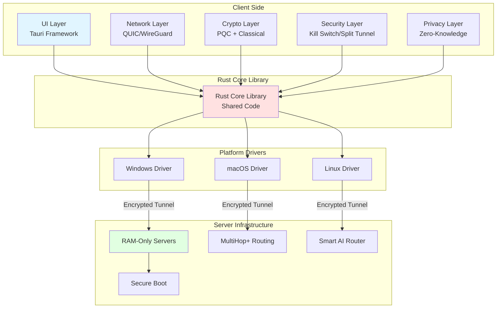

## Cryptographic Module Architecture

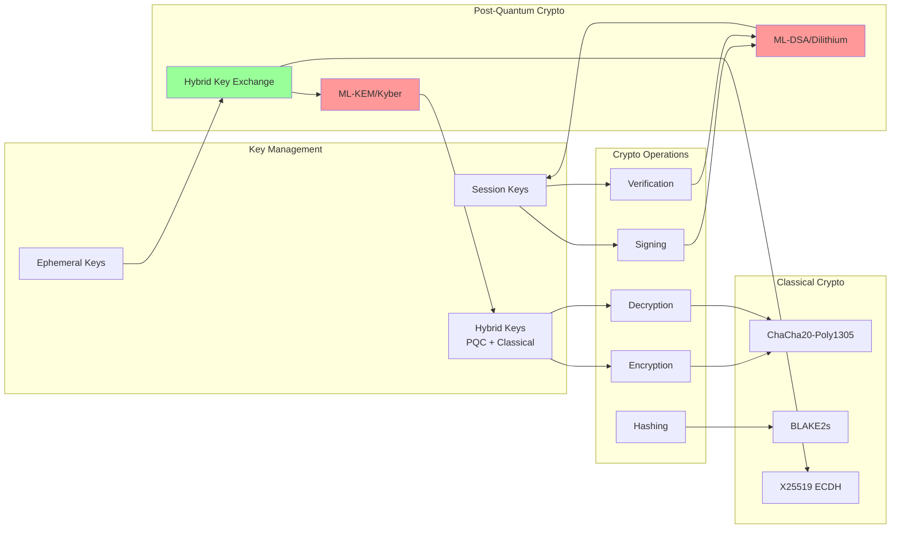

## Network Protocol Stack

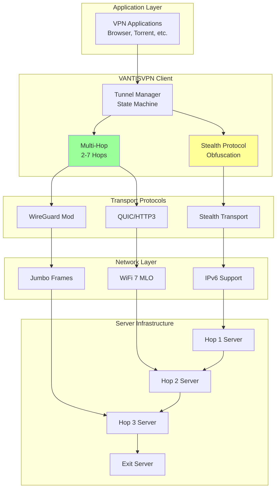

## Security Layer Architecture

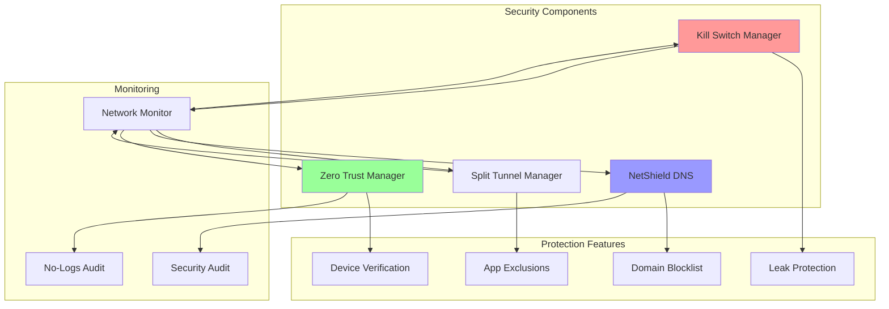

## Privacy & Identity Architecture

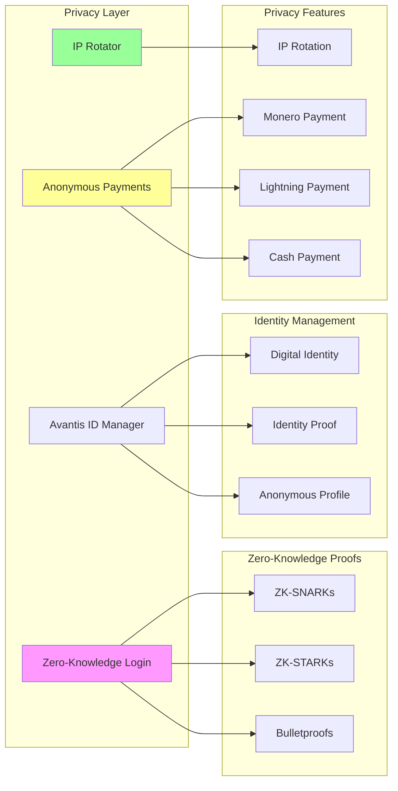

## Server Infrastructure Architecture

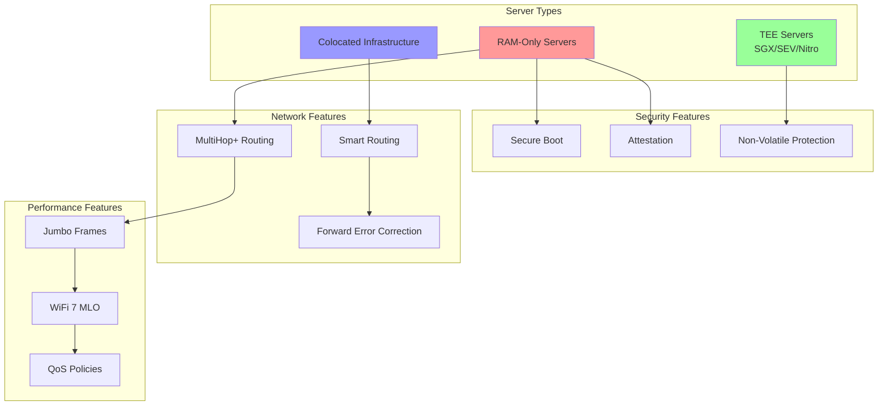

## Data Flow: Connection Establishment

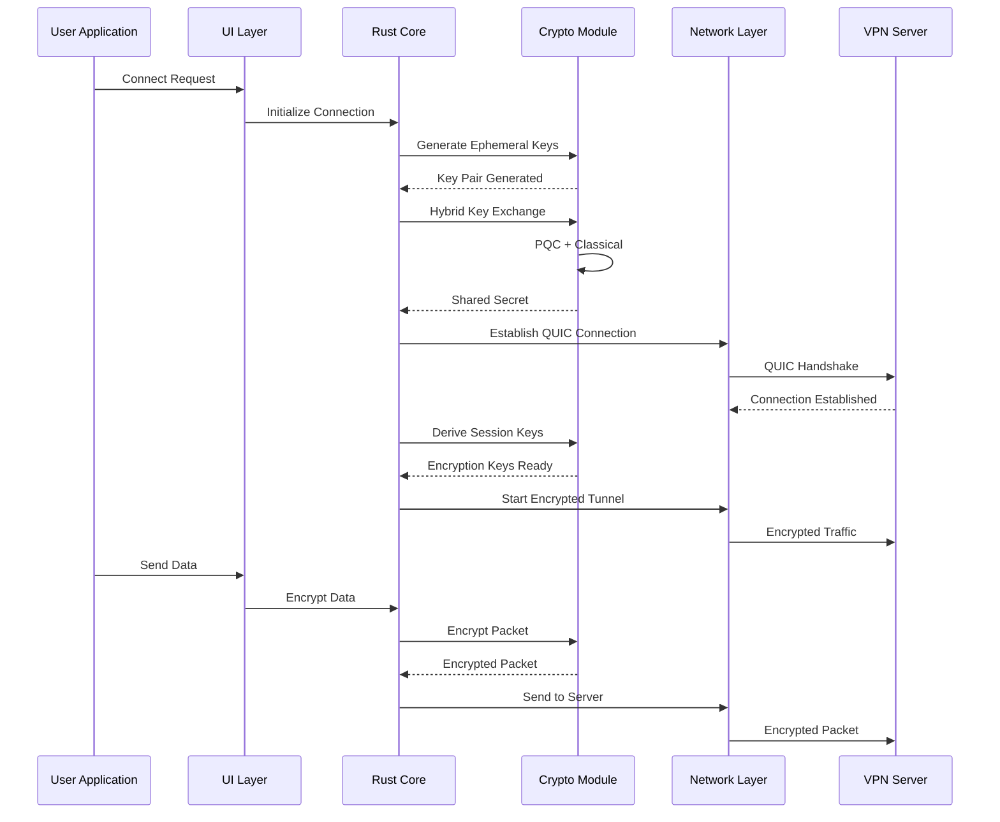

## Component Interaction Diagram

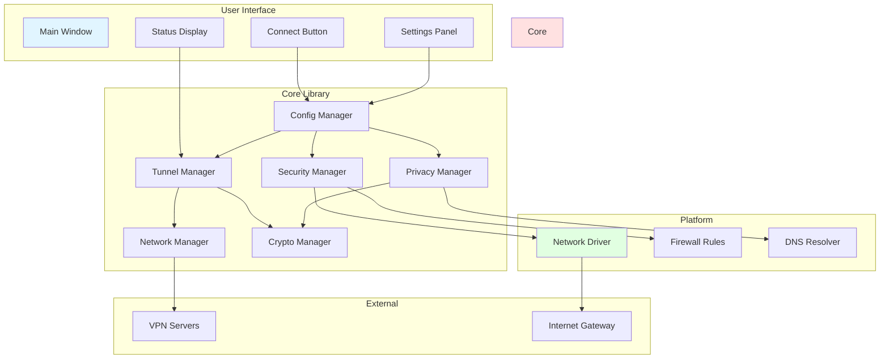

## Deployment Architecture

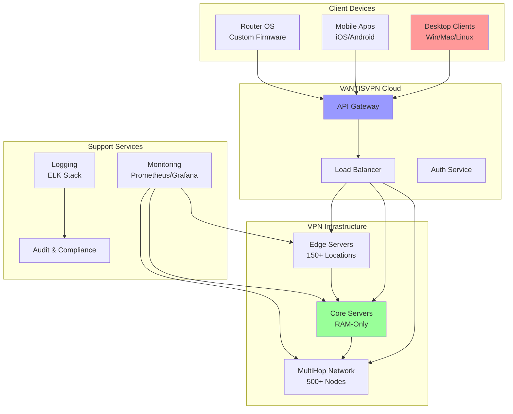

## Compliance & Security Architecture

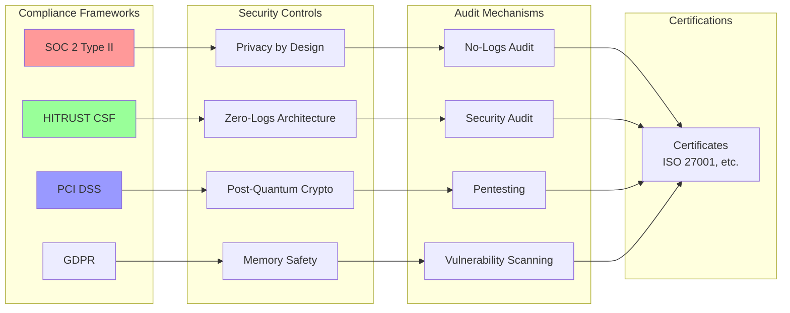

## Performance Optimization Architecture

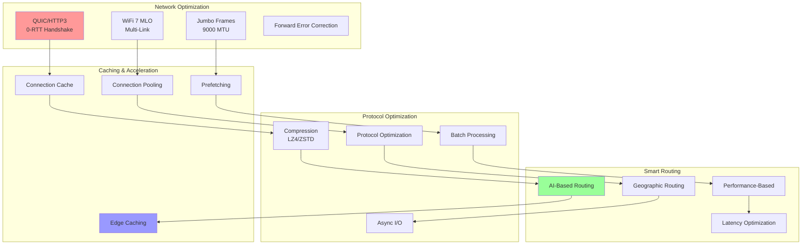

## Summary

This document provides comprehensive visual architecture diagrams for VANTISVPN, covering:

1. **High-Level System Architecture** - Overall system structure
2. **Cryptographic Module** - PQC and classical crypto integration
3. **Network Protocol Stack** - Multi-hop, QUIC, WireGuard
4. **Security Layer** - Kill switch, split tunnel, zero trust
5. **Privacy & Identity** - Zero-knowledge proofs, anonymous payments
6. **Server Infrastructure** - RAM-only, TEE, colocated servers
7. **Data Flow** - Connection establishment sequence
8. **Component Interaction** - How modules interact
9. **Deployment Architecture** - Cloud and edge infrastructure
10. **Compliance & Security** - Security controls and audits
11. **Performance Optimization** - Network and protocol optimizations

All diagrams use Mermaid format for easy rendering in GitHub and Markdown viewers.