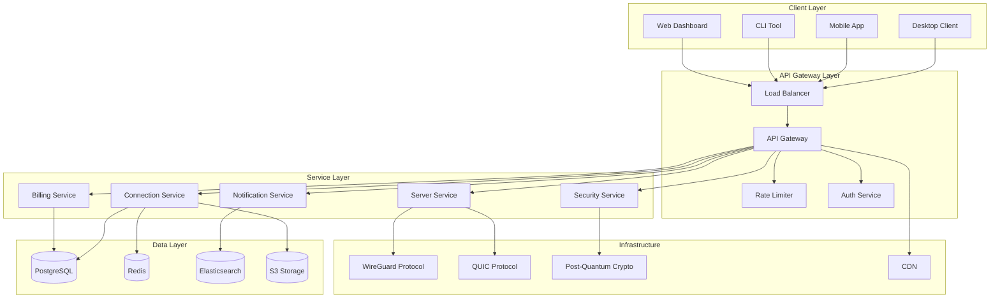
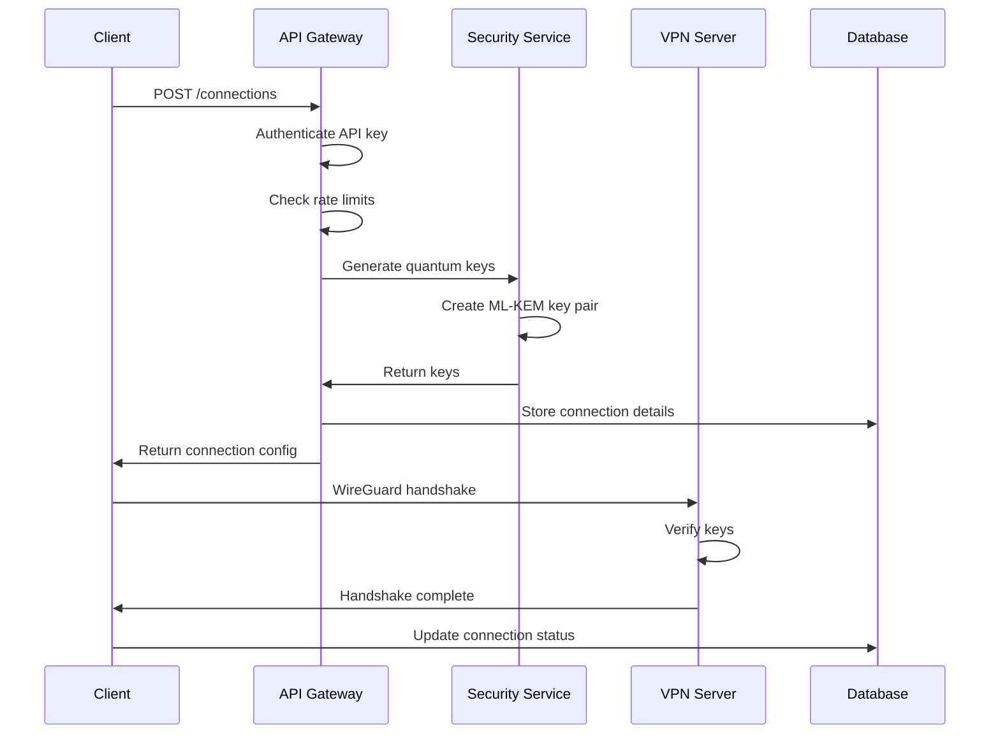
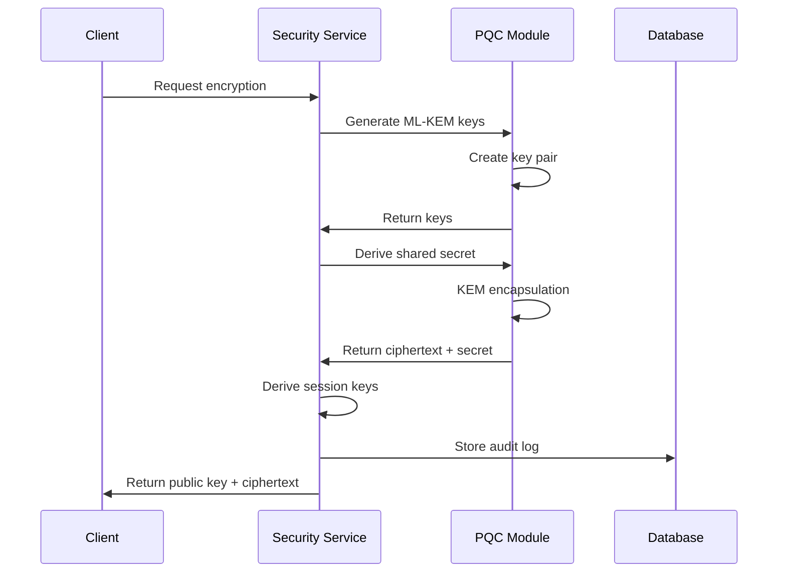
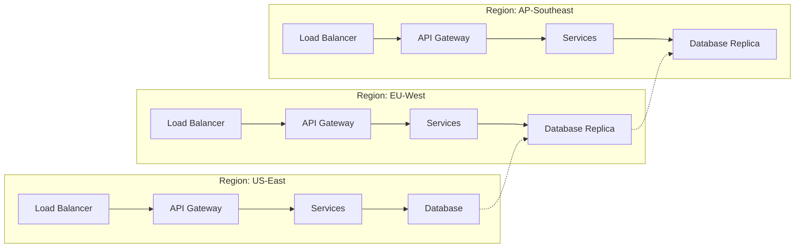

# Architecture Overview

VantisVPN is built on a modern, microservices architecture designed for security, performance, and scalability.

## System Architecture

## Core Components

### 1. Client Layer

**Purpose**: User interfaces and client applications

**Components**:
- **Desktop Client**: Native apps for Windows, macOS, Linux
- **Mobile Apps**: iOS and Android applications
- **CLI Tool**: Command-line interface for power users
- **Web Dashboard**: Browser-based management interface

**Technologies**:
- Rust (Desktop)
- Swift/Kotlin (Mobile)
- React/Next.js (Web)

### 2. API Gateway Layer

**Purpose**: Request routing, authentication, and rate limiting

**Components**:
- **Load Balancer**: Distributes traffic across services
- **API Gateway**: Routes requests to appropriate services
- **Rate Limiter**: Enforces API usage limits
- **Auth Service**: Handles authentication and authorization

**Technologies**:
- NGINX
- Kong Gateway
- Redis (rate limiting)
- JWT (authentication)

### 3. Service Layer

**Purpose**: Business logic and core functionality

#### Connection Service
Manages VPN connections and routing
- Connection lifecycle management
- Server selection algorithm
- Real-time connection monitoring
- Fallback and failover logic

#### Security Service
Handles security features and cryptography
- Post-quantum cryptography (ML-KEM, ML-DSA)
- Key generation and rotation
- Certificate management
- Security audit logging

#### Server Service
Manages VPN server infrastructure
- Server provisioning and scaling
- Health monitoring
- Load balancing
- Geographic routing

#### Billing Service
Manages subscriptions and billing
- Payment processing
- Subscription management
- Usage tracking
- Invoice generation

#### Notification Service
Handles notifications and alerts
- Email notifications
- Push notifications
- Webhook delivery
- Real-time alerts

### 4. Data Layer

**Purpose**: Data persistence and caching

**Components**:
- **PostgreSQL**: Primary database
- **Redis**: Caching and session storage
- **Elasticsearch**: Search and analytics
- **S3 Storage**: File storage and backups

### 5. Infrastructure Layer

**Purpose**: Network protocols and security

**Components**:
- **WireGuard Protocol**: Fast, modern VPN protocol
- **QUIC Protocol**: UDP-based transport for better performance
- **Post-Quantum Crypto**: Quantum-resistant encryption
- **CDN**: Global content delivery network

## Data Flow

### Connection Establishment Flow

### Security Flow

## Scalability

### Horizontal Scaling

- **Services**: Stateless services can scale horizontally
- **Database**: Read replicas for read-heavy workloads
- **Caching**: Redis cluster for distributed caching
- **CDN**: Global edge caching for static content

### Auto-scaling

- **CPU-based**: Scale services based on CPU usage
- **Memory-based**: Scale based on memory pressure
- **Request-based**: Scale based on request rate
- **Custom metrics**: Scale based on business metrics

## Security Architecture

### Defense in Depth

1. **Network Layer**: DDoS protection, rate limiting
2. **Application Layer**: Input validation, output encoding
3. **Data Layer**: Encryption at rest, access controls
4. **Cryptographic Layer**: Post-quantum algorithms, key rotation

### Zero Trust Principles

- **Never Trust, Always Verify**: Every request is authenticated
- **Least Privilege**: Minimal access by default
- **Assume Breach**: Designed with breach in mind
- **Continuous Monitoring**: Real-time security monitoring

## Performance Optimization

### Caching Strategy

- **API Responses**: Cache for 5 minutes
- **Server Lists**: Cache for 1 hour
- **User Sessions**: Cache in Redis
- **Static Content**: CDN caching

### Load Balancing

- **Round-robin**: Even distribution
- **Least connections**: Route to least busy server
- **Geographic**: Route to nearest server
- **Health-based**: Route to healthy servers only

## Monitoring & Observability

### Metrics

- **Connection metrics**: Active connections, success rate, latency
- **Server metrics**: CPU, memory, network I/O
- **Security metrics**: Auth failures, rate limit hits
- **Business metrics**: Active users, revenue, churn

### Logging

- **Structured logs**: JSON-formatted logs
- **Log levels**: DEBUG, INFO, WARN, ERROR
- **Log aggregation**: Centralized logging with ELK stack
- **Log retention**: 30 days for logs, 1 year for audit logs

### Tracing

- **Distributed tracing**: OpenTelemetry
- **Trace sampling**: 1% for production
- **Trace storage**: 7 days for traces

## Deployment Architecture

### Production Environment

### Multi-Region Deployment

- **US-East**: Primary region for US customers
- **EU-West**: European data center for GDPR compliance
- **AP-Southeast**: Asia-Pacific region
- **Database replication**: Multi-primary replication
- **Failover**: Automatic failover between regions

## Technology Stack

### Backend
- **Language**: Rust
- **Framework**: Tokio, Actix-web
- **Database**: PostgreSQL 15
- **Cache**: Redis 7
- **Message Queue**: RabbitMQ
- **Search**: Elasticsearch 8

### Frontend
- **Web**: Next.js 14, React 18
- **Mobile**: Swift (iOS), Kotlin (Android)
- **Desktop**: Tauri (Rust + Web)

### Infrastructure
- **Cloud**: AWS
- **Containers**: Docker, Kubernetes
- **CI/CD**: GitHub Actions
- **Monitoring**: Prometheus, Grafana
- **Logging**: ELK Stack

---

*Last Updated: March 6, 2026*