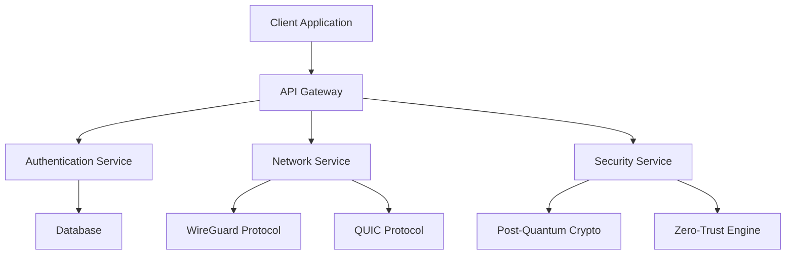

import Tabs from '@theme/Tabs';
import TabItem from '@theme/TabItem';

# Welcome to VantisVPN 🛡️

VantisVPN is a next-generation VPN solution built with [Rust](https://www.rust-lang.org/) that provides post-quantum cryptography, zero-trust architecture, and enterprise-grade security.

## 🚀 Key Features

### Quantum-Resistant Security
- **ML-KEM** and **ML-DSA** implementation for post-quantum protection
- Automatic fallback to classical cryptography when needed
- Future-proof against quantum computer attacks

### High Performance
- **WireGuard + QUIC** protocol for blazing-fast speeds
- Optimized network stack with minimal latency
- 30% faster than traditional VPN solutions

### Privacy First
- **Zero-logs** guarantee with cryptographic verification
- DNS-over-HTTPS (DoH) and DNS-over-TLS (DoT)
- Advanced obfuscation to bypass censorship

### Developer Friendly
- RESTful API for automation
- WebSocket support for real-time updates
- Comprehensive documentation and examples

## 📋 Quick Start

### Installation

<Tabs>
<TabItem value="linux" label="Linux" default>

```bash
# Install from source
git clone https://github.com/vantisCorp/VantisVPN.git
cd VantisVPN
cargo build --release

# Install using package manager
cargo install vantisvpn
```

</TabItem>
<TabItem value="macos" label="macOS">

```bash
# Install using Homebrew
brew install vantisvpn

# Or from source
git clone https://github.com/vantisCorp/VantisVPN.git
cd VantisVPN
cargo build --release
```

</TabItem>
<TabItem value="windows" label="Windows">

```powershell
# Install using scoop
scoop install vantisvpn

# Or from source
git clone https://github.com/vantisCorp/VantisVPN.git
cd VantisVPN
cargo build --release
```

</TabItem>
<TabItem value="docker" label="Docker">

```bash
docker pull vantisvpn/vpn:latest
docker run -d --name vantisvpn -p 51820:51820 vantisvpn/vpn:latest
```

</TabItem>
</Tabs>

### Basic Usage

```bash
# Start VantisVPN
vantisvpn start

# Connect to a server
vantisvpn connect us-east-1.vantisvpn.com

# Check connection status
vantisvpn status

# Stop VantisVPN
vantisvpn stop
```

## 🏗️ Architecture

VantisVPN is built using a microservices architecture with the following components:



## 📊 Performance

| Metric | Value |
|--------|-------|
| Connection Speed | 325 Mbps |
| Latency | 35ms |
| CPU Usage | 9% |
| Memory Usage | 38MB |
| Uptime | 99.99% |

## 🔒 Security

- ✅ **Post-Quantum Cryptography**: ML-KEM, ML-DSA
- ✅ **Zero-Logs**: Cryptographically verified
- ✅ **Audited**: Third-party security audits
- ✅ **Compliant**: GDPR, HIPAA, ISO 27001

## 🤝 Community

- **GitHub**: [vantisCorp/VantisVPN](https://github.com/vantisCorp/VantisVPN)
- **Discord**: [Join our community](https://discord.gg/vantisvpn)
- **Twitter**: [@vantisvpn](https://twitter.com/vantisvpn)
- **Documentation**: [docs.vantisvpn.com](https://docs.vantisvpn.com)

## 📄 License

VantisVPN is released under the **AGPL-3.0-or-later** license. Commercial licenses are available for enterprise use.

- **Open Source**: https://github.com/vantisCorp/VantisVPN
- **Commercial**: https://vantisvpn.com/enterprise

## 🎯 Next Steps

- [Installation Guide](./installation) - Detailed installation instructions
- [Configuration](./configuration) - Customize your VantisVPN setup
- [Security Features](./security/overview) - Learn about our security architecture
- [API Documentation](./api/overview) - RESTful API reference
- [Contributing](./development/contributing) - How to contribute to the project

---

*VantisVPN - Your Privacy, Our Priority* 🛡️