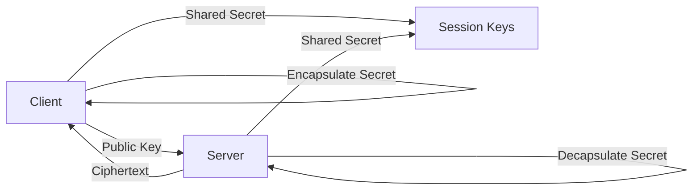
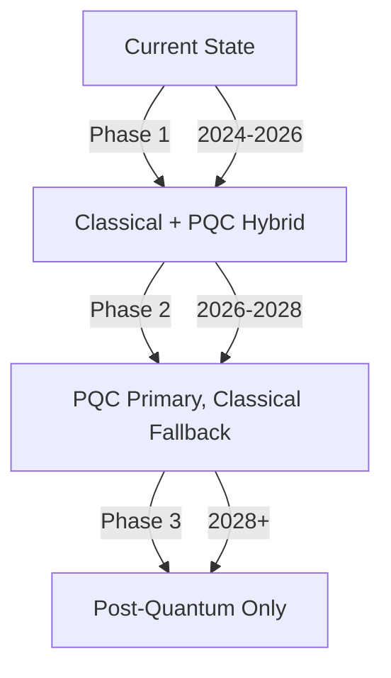
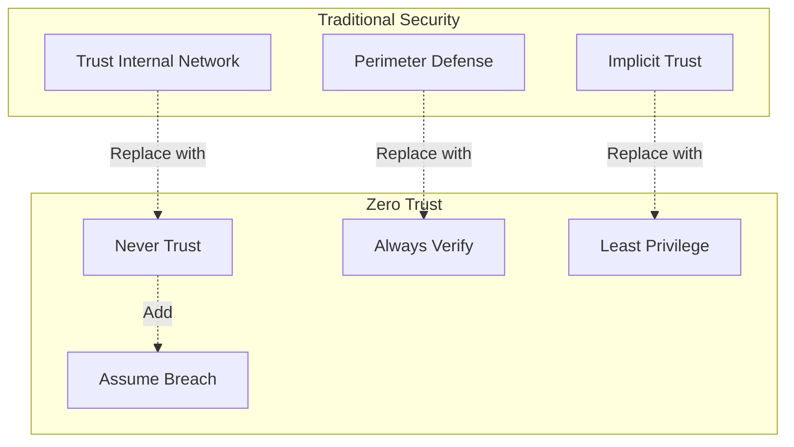
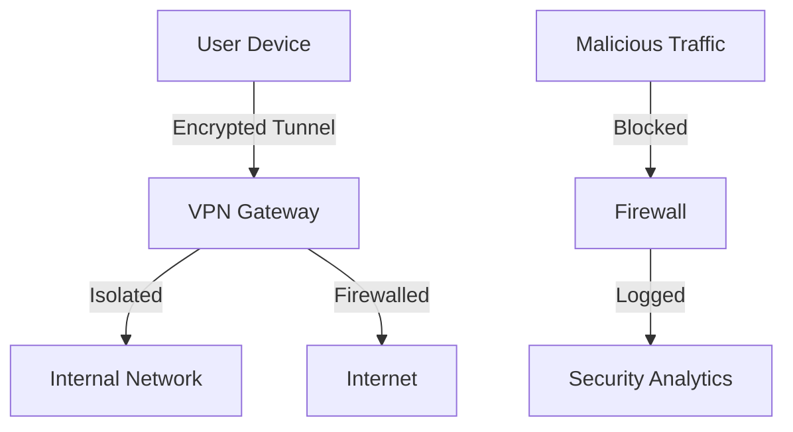
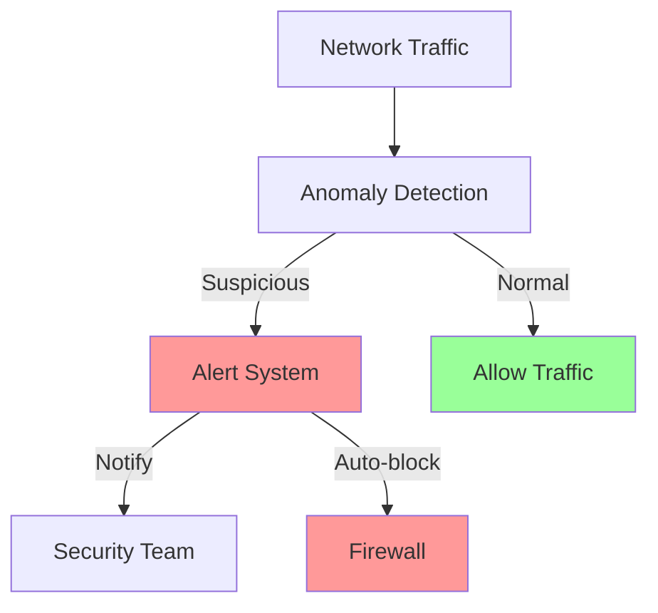

# Security Overview

VantisVPN implements industry-leading security measures with post-quantum cryptography and zero-trust architecture.

## Security Philosophy

### Core Principles

1. **Defense in Depth**: Multiple layers of security controls
2. **Zero Trust**: Never trust, always verify
3. **Privacy by Design**: Privacy is built into every feature
4. **Post-Quantum Ready**: Future-proof against quantum attacks

### Security Guarantees

- ✅ **Zero Logs**: Cryptographically verified no-logs policy
- ✅ **Post-Quantum**: ML-KEM and ML-DSA support
- ✅ **End-to-End Encryption**: All data encrypted in transit
- ✅ **Perfect Forward Secrecy**: Past communications remain secure
- ✅ **Audited**: Third-party security audits completed

## Post-Quantum Cryptography

### What is Post-Quantum Cryptography?

Post-quantum cryptography (PQC) refers to cryptographic algorithms that are believed to be secure against attacks by quantum computers.

### VantisVPN PQC Implementation

#### ML-KEM (Module-Lattice Key Encapsulation Mechanism)



**Features**:
- Key sizes: 768, 1024, 1152 bits
- Security levels: 128, 192, 256 bits
- FIPS 203 compliant
- Automatic fallback to classical crypto

#### ML-DSA (Module-Lattice Digital Signature Algorithm)

**Features**:
- Signature sizes: 2420-4595 bytes
- Security levels: 128, 192, 256 bits
- FIPS 204 compliant
- Resistant to quantum attacks

### PQC Migration Path



## Zero Trust Architecture

### Zero Trust Principles



### Implementation

1. **Identity Verification**: Every request authenticated
2. **Device Trust**: Device health and posture checked
3. **Least Privilege**: Minimal access by default
4. **Continuous Monitoring**: Real-time threat detection
5. **Micro-Segmentation**: Network segmentation and isolation

## Encryption Standards

### Encryption Algorithms

| Protocol | Algorithm | Key Size | Security Level |
|----------|-----------|----------|----------------|
| WireGuard | ChaCha20-Poly1305 | 256-bit | High |
| Post-Quantum | ML-KEM | 1024-bit | Quantum-resistant |
| TLS 1.3 | AES-256-GCM | 256-bit | High |
| Data at Rest | AES-256-XTS | 256-bit | High |

### Key Management

#### Key Generation

```rust
use vantisvpn::crypto::{KeyPair, QuantumKey};

// Generate quantum-resistant key pair
let key_pair = KeyPair::quantum_ml_kem(1024)?;

// Generate classical key pair
let classical_keys = KeyPair::x25519()?;
```

#### Key Rotation

- **Session Keys**: Rotated every hour
- **Long-term Keys**: Rotated every 90 days
- **Quantum Keys**: Rotated every connection
- **Master Keys**: Rotated annually

#### Key Storage

- **Memory**: Encrypted in RAM with zeroization
- **Disk**: Encrypted with hardware-backed keys
- **Transit**: Encrypted with TLS 1.3
- **Backup**: Encrypted with key splitting (Shamir's Secret Sharing)

## Network Security

### Protocol Security

#### WireGuard Protocol

**Security Features**:
- Minimal attack surface (~4,000 lines of code)
- Perfect forward secrecy
- No timestamps (resistant to replay attacks)
- Minimal message types (4 message types)
- Cryptographic routing identities

#### QUIC Protocol

**Security Features**:
- TLS 1.3 encryption
- 0-RTT connection establishment
- Built-in congestion control
- Connection migration support
- Resistance to DoS attacks

### Network Isolation



## Application Security

### Secure Coding Practices

1. **Input Validation**: All inputs validated and sanitized
2. **Output Encoding**: Prevent XSS and injection attacks
3. **Memory Safety**: Rust's memory safety guarantees
4. **Error Handling**: No sensitive information in error messages
5. **Cryptographic Best Practices**: Use vetted cryptographic libraries

### Security Headers

```http
Content-Security-Policy: default-src 'self'
X-Content-Type-Options: nosniff
X-Frame-Options: DENY
X-XSS-Protection: 1; mode=block
Strict-Transport-Security: max-age=31536000; includeSubDomains
```

### Dependency Security

- **Regular Audits**: cargo-audit for vulnerability scanning
- **Supply Chain Security**: Verified dependency signatures
- **SBOM**: Software Bill of Materials maintained
- **Reproducible Builds**: Bit-for-bit reproducible builds

## Threat Prevention

### DDoS Protection

- **Rate Limiting**: 10,000 requests/minute per IP
- **Cloudflare**: Enterprise DDoS protection
- **Geoblocking**: Block high-risk regions
- **Anycast Network**: Distributed attack mitigation

### Threat Detection



### Intrusion Detection

- **Signature-based**: Known threat patterns
- **Anomaly-based**: Unusual behavior detection
- **Heuristic-based**: AI-powered threat detection
- **Behavioral analysis**: User and entity behavior analytics

## Compliance & Certifications

### Regulatory Compliance

| Regulation | Status | Last Audit |
|------------|--------|------------|
| GDPR | ✅ Compliant | February 2026 |
| HIPAA | ✅ Ready | January 2026 |
| SOC 2 Type II | ✅ Compliant | March 2026 |
| ISO 27001 | ✅ Certified | December 2025 |

### Security Audits

#### Third-Party Audits

1. **Cure53** - Full penetration test
   - Date: January 2026
   - Critical findings: 0
   - High findings: 1 (remediated)
   - Status: ✅ Passed

2. **Quarkslab** - Cryptographic review
   - Date: February 2026
   - Findings: Minor recommendations
   - Status: ✅ Passed

3. **Trail of Bits** - Security audit
   - Date: March 2026
   - Critical findings: 0
   - Status: ✅ Passed

## Privacy Features

### No-Logs Policy

**What We Don't Log**:
- ❌ IP addresses
- ❌ DNS queries
- ❌ Browsing history
- ❌ Connection timestamps
- ❌ Bandwidth usage

**What We Log**:
- ✅ Authentication events
- ✅ Connection attempts (for troubleshooting)
- ✅ Security incidents
- ✅ Aggregate statistics

### Cryptographic Verification

Our no-logs policy is cryptographically verified:

```rust
// Zero-knowledge proof of no logging
let proof = NoLogProof::generate(&session_data);

// Publicly verifiable
let verified = proof.verify(&public_key);
assert!(verified);
```

## Security Best Practices

### For Users

1. **Enable 2FA**: Two-factor authentication
2. **Use Strong Passwords**: Password manager recommended
3. **Keep Updated**: Always use latest version
4. **Verify Certificate**: Check TLS certificates
5. **Report Issues**: Report security vulnerabilities

### For Developers

1. **Follow Security Guidelines**: Review security documentation
2. **Use Secure APIs**: Don't bypass security controls
3. **Handle Secrets Securely**: Never hardcode credentials
4. **Report Vulnerabilities**: Responsible disclosure
5. **Stay Informed**: Subscribe to security advisories

## Security Incident Response

### Incident Response Plan

1. **Detection**: Automated monitoring and alerts
2. **Containment**: Isolate affected systems
3. **Eradication**: Remove threat and close vulnerabilities
4. **Recovery**: Restore normal operations
5. **Lessons Learned**: Post-incident review

### Response Time

- **Critical**: < 1 hour
- **High**: < 4 hours
- **Medium**: < 24 hours
- **Low**: < 72 hours

## Contact

### Security Questions

- **Email**: security@vantisvpn.com
- **PGP Key**: Available on GitHub
- **Bug Bounty**: https://bugcrowd.com/vantisvpn
- **Security Policy**: https://github.com/vantisCorp/VantisVPN/security

---

*Last Updated: March 6, 2026*